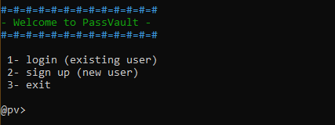
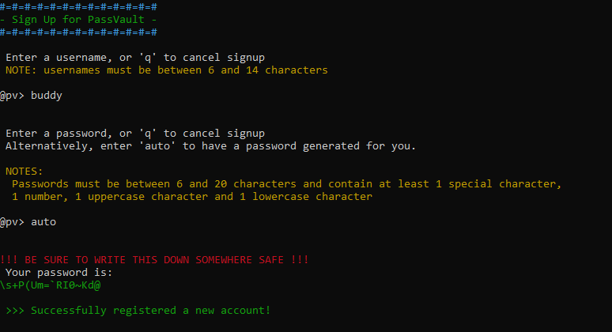
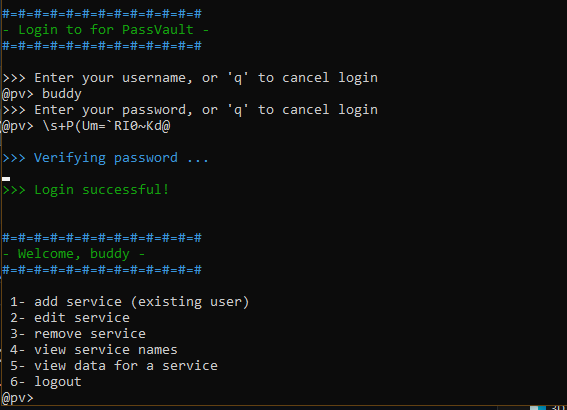
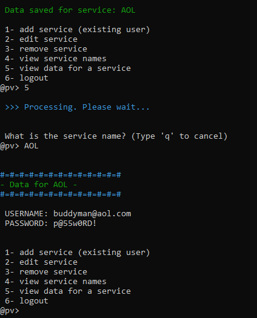

PassVault
===
PassVault is a simple password managment program to be run on a command prompt designed as a final project for Cryptography (CS 427). It was created in python and uses secure functions for hashing and encryption to safely store the data of multiple users locally. The project code and writeup may be found [here](https://github.com/mjrad/PassVault).

I designed the flow of the program, user systems and prompts. Additionally, I debugged the completed product.

The rest of the project was handled by my team members.
  
Screenshots
===

Start Menu  

Signing Up  

Logging In  

Saving and Accessing Data  

