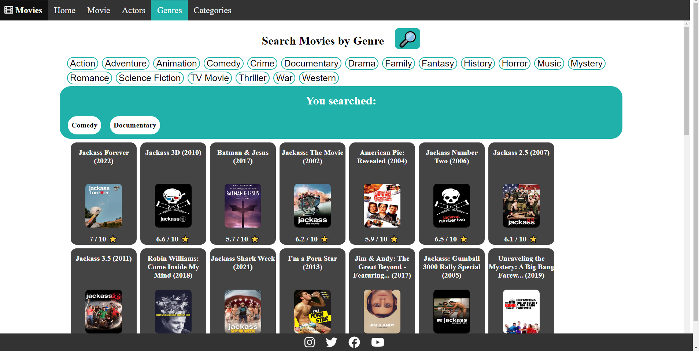
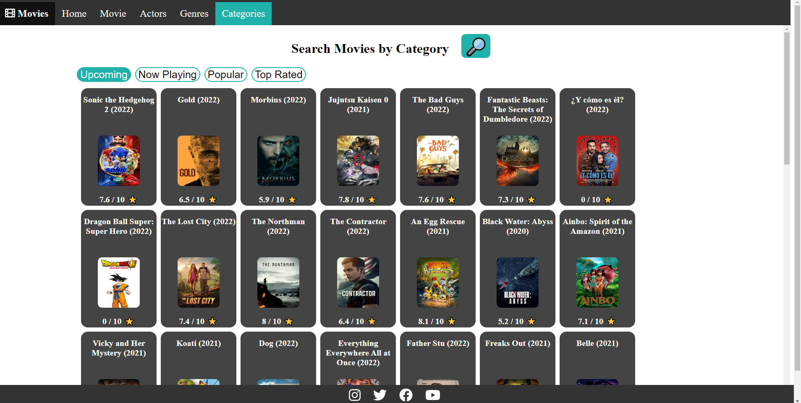
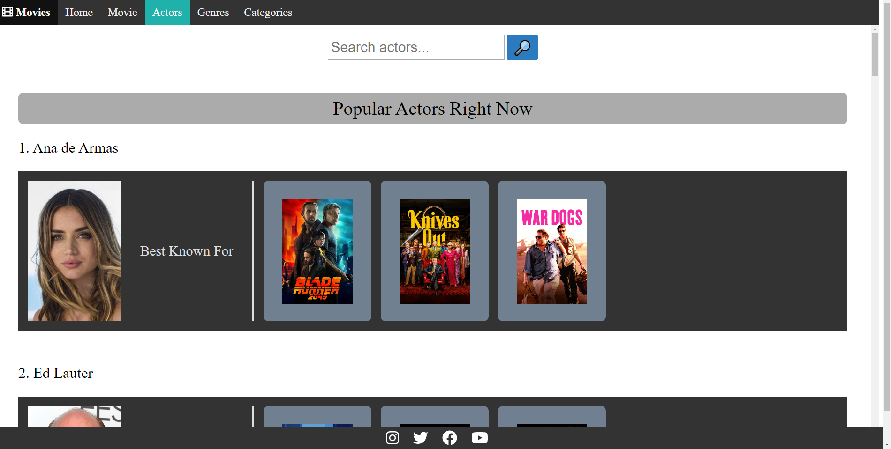
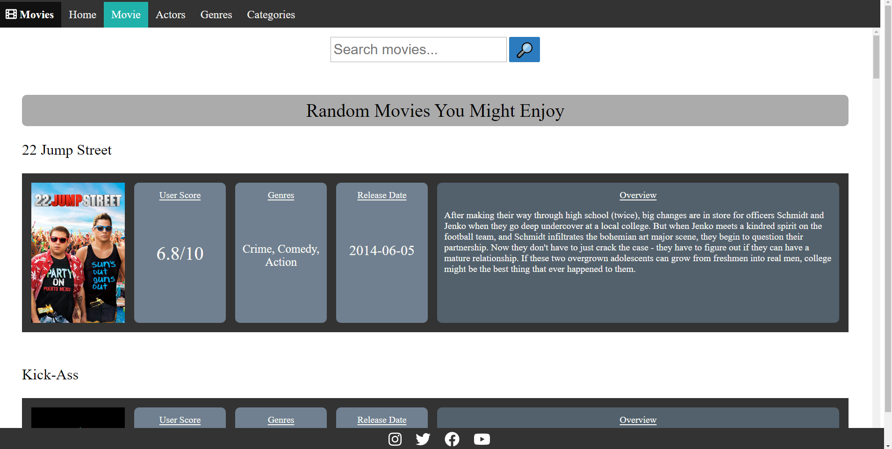

Movis
===
Movis was created as a final project for Advanced Web Development (CS499). It was created with CreateReactApp and uses hooks that call The Move Database API. The Movie Database can be found [here](https://developers.themoviedb.org/3). The project code can be found [here](https://github.com/mjrad/Movis).

With this site, a user may search popular actors, or find movies through several means. Movies may be searched for, or they may be filtered by genre, popular, upcoming, and now playing.

I was responsible for the genre and category search pages, including styling and hooks.

The rest of the project was handled by my team members.

Screenshots
===

